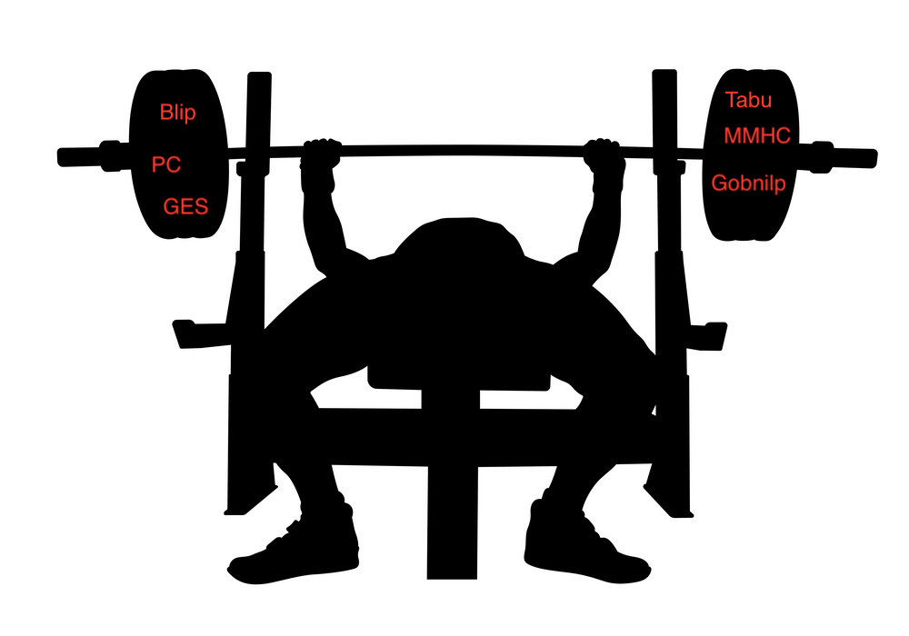

<snippet>
  <content><](https://snakemake.bitbucket.io)

#  
# Benchpress

Systematic benchmarks of structure learning algorithms for graphical models.
The documentation is found here https://benchpressx.readthedocs.io.

## Reqirements
- [Snakemake](https://snakemake.readthedocs.io/en/stable/) ([instructions for installation](https://docs.docker.com/engine/install/))
- [Docker](https://www.docker.com/) ([instructions for installation](https://docs.docker.com/engine/install/))
- [Singularity](https://sylabs.io/guides/3.6/admin-guide/installation.html) ([instructrions for installation](https://sylabs.io/guides/3.6/admin-guide/installation.html))
- Linux/Unix (Singularity currently only has a Beta release for OSX which is not enough for this purpose)
## Installation

### Cloning the repository

`$ git clone git@github.com:felixleopoldo/benchpress.git && cd benchpress`

#### Notes
On some systems, you might also have to explicitly install squash-tools. This can be done using conda as

`$ conda install -c conda-forge squash-tools`

## Usage

To run the simulation setup in config.json type

`$ snakemake roc --cores 20 --use-singularity --configfile config.sample.json`

A roc curve defined by config.sample.json is found in the file files/ROC.eps and can be viewed with e.g. evince as

`$ evince files/ROC.eps`

## Contributing

1. Fork it!
2. Create your feature branch: `git checkout -b my-new-feature`
3. Commit your changes: `git commit -am 'Add some feature'`
4. Push to the branch: `git push origin my-new-feature`
5. Submit a pull request :D

## History

This is the first program of its kind.

## License

This project is licensed under the Apache 2.0 License - see the [LICENSE](LICENSE) file for details

</content>
  <tabTrigger></tabTrigger>
</snippet>